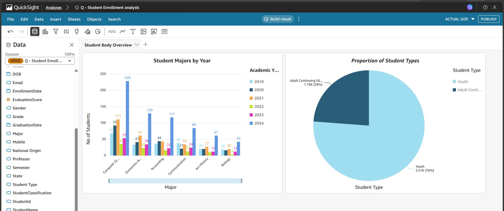
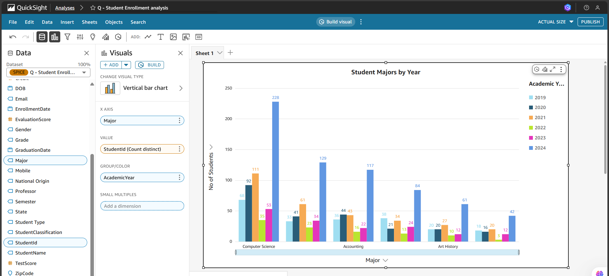
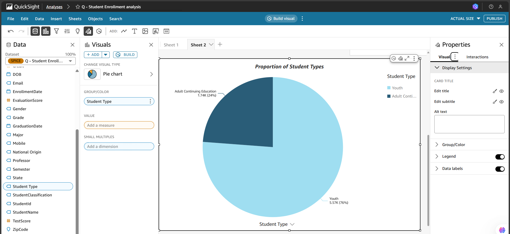
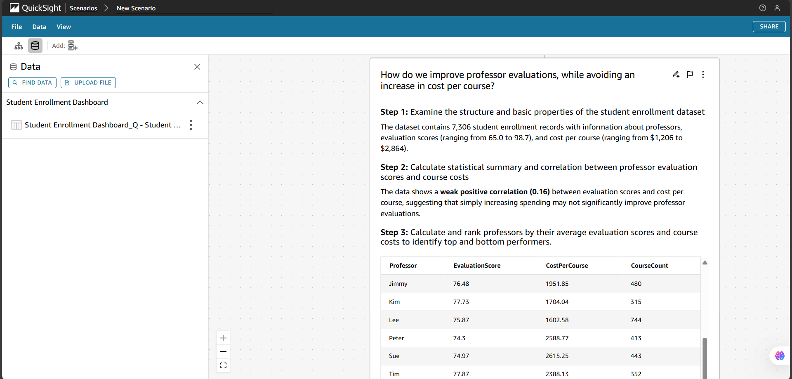

# From College Boards to Dashboards 
A Business Intelligence project using **AWS QuickSight** and **Amazon Q** to analyze student enrollment patterns, uncover insights, and simulate strategies for improving satisfaction without increasing costs.

---

## Project Overview
This project simulates a real-world **business intelligence workflow** for a fictional community college.  
The goal: **improve student satisfaction without increasing costs** by analyzing enrollment data, professor evaluations, and course expenses.

Key highlights:
- Built interactive dashboards with **Amazon QuickSight**.
- Configured **automated dataset refresh** (Asia/Kolkata timezone).
- Enhanced dataset fields (e.g., `Student Type` categorization).
- Developed **scenarios** to balance cost vs. satisfaction.

---

## Tech Stack
- **AWS QuickSight** – BI dashboards & visualizations  
- **Amazon Q** – Natural language Q&A for insights  
- **Python (optional preprocessing)** – Data cleaning & transformations  
- **Data Visualization** – Charts, pie graphs, scenario analysis  

---

## Key Features
- **Automated Dataset Refresh**: Weekly updates ensure fresh insights.  
- **Enhanced Fields**: `Student Type` (Youth vs. Adult Continuing Education) for better segmentation.  
- **Interactive Visuals**:
  - Student Majors by Year (bar chart).
  - Proportion of Student Types (pie chart).  
- **Scenario Analysis**: *“Improving Student Satisfaction Without Increasing Costs”* – explores professor evaluations vs. course costs.  
- **Verified Q&A**: Natural language queries like:
  - *“Which instructor got the best average evaluation score?”* → Jill (78.63).  
  - *“Which courses are most expensive?”* → Big Data ($2,692.58).  

---

## Business Impact
- Identified that **Youth students form 76% of enrollment**, guiding resource allocation.  
- Highlighted correlation between **professor evaluations and course costs**.  
- Provided actionable insights for **cost optimization without reducing satisfaction**.  

---

## Screenshots

### Dashboard Overview 

### Student Majors by Year 
 

### Proportion of Student Types 
 

### Scenario: Improving Student Satisfaction Without Increasing Costs 

---

## 📄 Project Report 
- For full details of the analysis and workflow, you can view the complete report here:
- [Project.pdf](docs/Project.pdf)

## Learning Outcomes
- Hands-on with **AWS QuickSight BI workflows**.  
- Experience in **data-driven storytelling**.  
- Skills in **scenario development & strategic analysis**.  
- Ability to **translate technical insights into business recommendations**.  

---

## Future Improvements
- Predictive modeling for enrollment trends.  
- Real-time integration with student feedback systems.  
- Advanced cost optimization recommendations.  

---

## How to Explore
1. Clone the repository.  
2. Review the `README.md` for project context.  
3. Explore screenshots and documentation in [Project.pdf](docs/Project.pdf).   

---

## Author
**Sreerath Srideep**  
- 🎓 BSc in Data Science   
- 🌐 [LinkedIn](https://linkedin.com/in/your-link) | [GitHub](https://github.com/sreerath-srideep)

